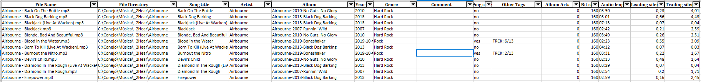

# MP3 DB 🎵

A Python utility to recursively scan '.mp3' files from the current directory and its subdirectories, extract ID3 metadata and audio properties, and export the results to a timestamped Excel file.

## Features
- Recursively scans the current directory and all subdirectories for '.mp3' files only.
- Extracts common ID3 metadata such as:
  - Song title
  - Artist
  - Album
  - Year
  - Genre
  - Comment
- Flags whether the 'Comment' field matches a recognized country name using 'pycountry'.
- Detects and lists ID3 tags outside a predefined whitelist.
- Counts the number of embedded cover art images ('APIC').
- Retrieves technical audio properties including:
  - Bit rate
  - Audio length
  - Leading silence
  - Trailing silence
  - BPM estimation
- Exports all results to an Excel file named using the format: 'mp3db_YYYYMMDDHHMMSS.xlsx'

## Output Columns
The generated Excel file includes the following columns:
- File Name
- File Directory
- Song title
- Artist
- Album
- Year
- Genre
- Comment
- Wrong country
- Other Tags
- Number of cover art images
- Bit rate
- Audio length
- Length of silence at the beginning of the track
- Length of silence at the end of the track
- BPM estimation

## Requirements
This script uses the following Python libraries:
- pandas>=2.0
- pycountry>=24.0
- mutagen>=1.47
- pydub>=0.25
- numpy>=1.24
- librosa>=0.10
- openpyxl>=3.1

## Installation
Install the dependencies with:
'pip install pandas pycountry mutagen pydub numpy librosa openpyxl'

## Usage
Run the script from the directory you want to analyze:
'python mp3_db.py'

The script will:
- Scan the current directory and all subdirectories for '.mp3' files
- Extract metadata and audio properties for each file
- Generate a timestamped Excel file in the current location

## Notes
- The script only analyzes '.mp3' files
- The target directory is not provided as an input parameter; the current working directory is always used as the root for scanning
- BPM estimation is performed with 'librosa' and is limited to the first 120 seconds for performance reasons
- Silence detection uses configurable thresholds defined in the script

## Example Output Filename

mp3db_20260607194530.xlsx

## Possible Future Improvements
- Add command-line arguments for optional configuration
- Export to CSV as an alternative output format
- Improve logging and error reporting
- Add unit tests
- Package the tool for easier reuse
